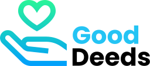

# GoodDeeds

##Welcome to our Final Project with Penn LPS Bootcamp.

- To begin we recommend that you checkout our [Presentation](https://docs.google.com/presentation/d/1pO-N2DIgKoBmlrJ0XbjlgqDsIfM6vazRnIX6vr50us4/edit?usp=sharing) prior to

- To begin you will want to request api keys from:
  Event brite API
  &
  Google Maps API

- After you have optained the API keys, make a git clone of our repository.

- Run npm i to download the node modules

- Run the command mongod in your root terminal, do the same with mongo to launch your server.

- Run npm start in the GOODDEEDS root folder to launch our application.

- ENJOY!!!

### Our team is continuing to develop our application, if you encounter any issues please let us know.

#### We would love to get you a pitcher of beer for your time :)

## Built with:

- [Express npm package](https://www.npmjs.com/package/express)
- [Google Fonts](https://fonts.google.com/)
- [Eventbrite API]()
- [Google Maps API]()
- [GMaps.js]()
- [Heroku](https://heroku.com)
- [JavaScript](http://javascript.com/)
- [jQuery](http://jquery.com/)
- [MySQL Workbench](https://www.mysql.com/products/workbench/)
- [React](https://reactjs.org)
- [Node.js](https://nodejs.org)
- [Express](https://expressjs.com)
- [Github](https://github.com)
- [Twitter Bootstrap CSS framework](http://getbootstrap.com/)
