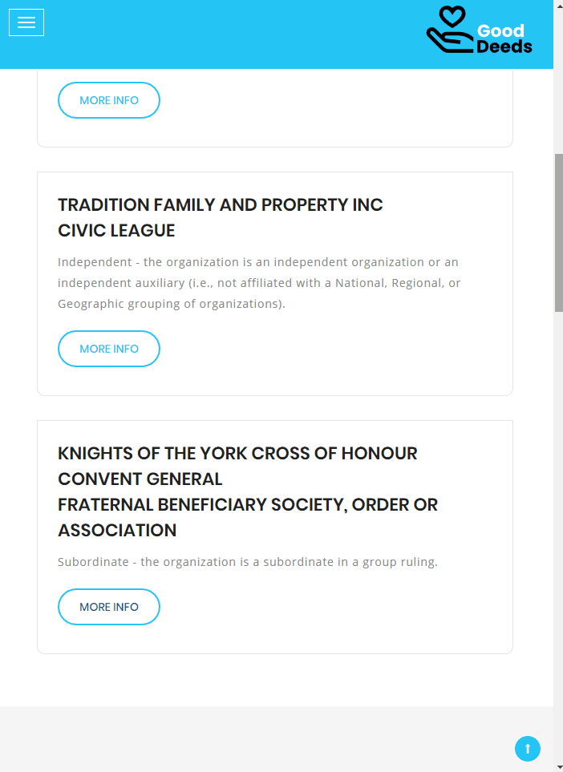
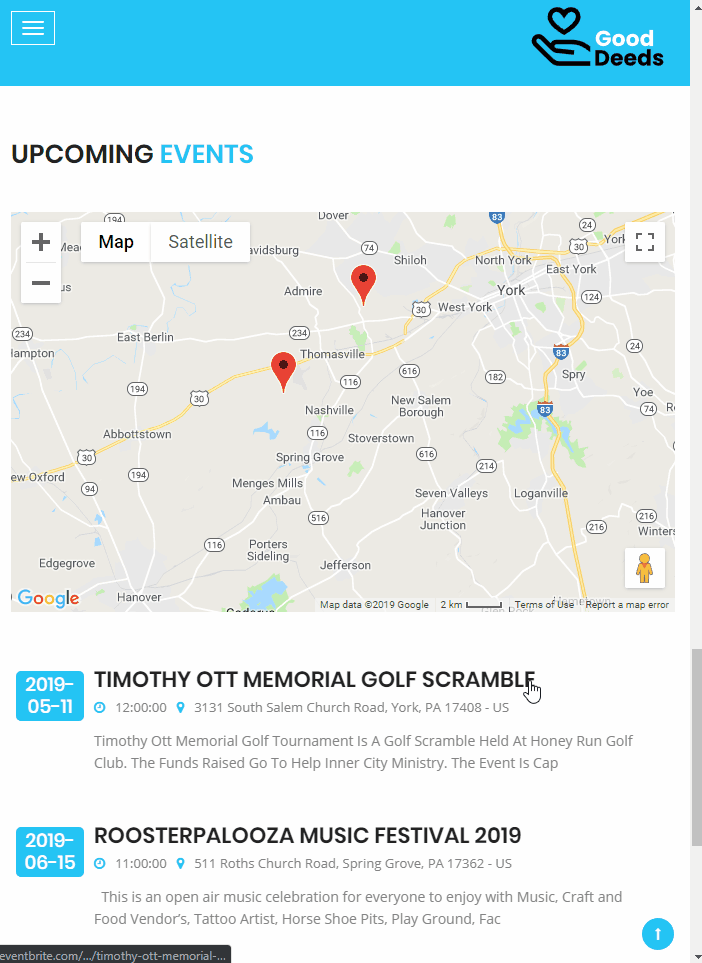

# GoodDeeds

## Table of contents
  * [About this project](#about-this-project)
  * [Application overview](#about-this-app)
  * [Getting started](#getting-started)
  * [How to run app](#how-to)
  * [Demonstrations](#demo)
    * [Geolocation](#geolocation)
    * [Main Charity Suggestions](#more-charity)
    * [Main Page Overview](#scroll)
    * [Main Charity Events](#charity-events)
    * [Searching](#searching)
  * [Technologies used to create app](#technologies-used)
  * [Future code development](#feature-enhancements)
  * [Issues](#issues)
  * [Author](#author)

##  About this project
Welcome to our Final Project with the University of Pennsylvania LPS Coding [Bootcamp](https://bootcamp.sas.upenn.edu/).  

The idea for the application came from trying to teach my daughter the importance of helping others in our community and how to get started “doing good deeds”. While trying to search for a local charity we found ourselves reviewing 100 different links, websites, and reviews. There had to be a better way to do this ...

Many of us are not aware of what charities are in our area, and what events they host. GoodDeeds was created to address this as a one-stop app that makes it easier for everyone to find where to donate their time, money, and efforts in helping others and improving their communities.

## Deployed [GoodDeeds](https://limitless-harbor-38694.herokuapp.com/) app on Heroku!

##  Application Overview
The application's main page will request for the user to allow geolocation. Once geolocation is allowed the page is divided in 2 sections with 2 maps.  Top section will automatically suggest 3 local charities and map them.  Bottom section will automatically suggest 5 charity events within a 25 mile radius in a carousel style card slider. 

If the user would like to see more results a search option was created.  This option will allow the user search using a Zip Code, Radius (miles), and either a Charity/Charity Event options must be selected.  Results will be displayed in "cards" under the map, the user may also scroll through the results and side swipe for more.  Also, the map will display "pins" for locations.  Pins will take to a site with more details about the charity; This can also be acomplished from the result page "cards" by selecting the "MORE INFO" button. 

##  Getting Started

- To begin we recommend that you checkout our [Presentation](https://docs.google.com/presentation/d/1pO-N2DIgKoBmlrJ0XbjlgqDsIfM6vazRnIX6vr50us4/edit?usp=sharing) prior to running our application !

- Next you will want to request api keys from:
  Event brite API | Google Maps API | Charity Navigator API

##  How to Run Application
These steps are taken in your terminal:

* After you have optained the API keys, make a clone of our repository from Github.
<pre>git clone [link]</pre>

* Run npm i to download the node modules
<pre>npm i</pre>

* Run the command mongod in your root terminal, do the same with mongo to launch your server.
<pre>mongod</pre>

* Run npm start in the GOODDEEDS root folder to launch our application.
<pre>npm start</pre>

* ENJOY!!!

##  Technologies used to build app

- [Express npm package](https://www.npmjs.com/package/express)
- [Google Fonts](https://fonts.google.com/)
- [Eventbrite API](https://www.eventbrite.com/platform/api)
- [Google Maps API](https://developers.google.com/maps/documentation/)
- [Charity Navigator API](http://api.charitynavigator.org/)
- [GMaps.js](https://hpneo.dev/gmaps/)
- [Passport](http://www.passportjs.org/)
- [JavaScript](http://javascript.com/)
- [jQuery](http://jquery.com/)
- [MongoDB](https://www.mongodb.com/)
- [React](https://reactjs.org)
- [Node.js](https://nodejs.org)
- [Express](https://expressjs.com)
- [Github](https://github.com)
- [Twitter Bootstrap CSS framework](http://getbootstrap.com/)
- [Balance-text](https://www.npmjs.com/package/balance-text)
- [Google Maps Geo-location](https://developers.google.com/maps/documentation/javascript/examples/map-geolocation)
- [Axios](https://www.axios.com)
- [Bcryptjs](https://www.npmjs.com/package/bcryptjs)
- [Jsonwebtoken](https://jwt.io/)
- [Mongoose](https://mongoosejs.com/)
- [React-router-dom](https://www.npmjs.com/package/react-router-dom)
- [Validator](https://validatejs.org/)

##  Video Demonstrations

###  Geolocation

###  Main Page Charity Suggestions

###  Main Page Overview

###  Main Page Charity Event Suggestions

###  Searching

## Our Plans for Future Development

- Add sidebar for advertisements (App monetization)
- Implementation of a “donate” button using a payment request API to allow users to donate from the app to their prefered charities i.e recurring monthly donations. such as (paypal or venmo)
- Social experience. Allowing users to “follow” other gooddeeders, leave comments, reviews, and suggest.
- Rewards systems (similar to leveling up) to encourage users to continue doing good deeds!
- Enable functionality for giving donations, becoming a donor, charity fundraising, and becoming a volunteer.
- Creation of a detailed page for each charity using the API.
- The creation of a “backdoor” mode where charities can log in and control their content.
- Fully built app through heroku deployment
- Creation of categories (i.e children support, religious, disaster relief) and suggestions based on previous Good Deeds of the user for future Good Deeds.
- Full app built in React.

##  Issues

Our team is continuing to develop our application, if you encounter any issues please let us know.

##  Authors

* Ruben Galleguillos - [Ruben Galleguillos](https://rhgcodes.github.io/)
* Dirk Kiesewetter - [Dirk Kiesewetter](https://dirk-kiesewetter.github.io/Bootstrap-Portfolio/)
* Nathan Schmidt - [Nathan Schmidt](https://natedogg484.github.io/bootstrap-portfolio/)
* Michael Pohlman - [Michael Pohlman](https://github.com/mpohlman17)

## We would love to get you a pitcher of beer, hangout and talk about coding sometime :) 
